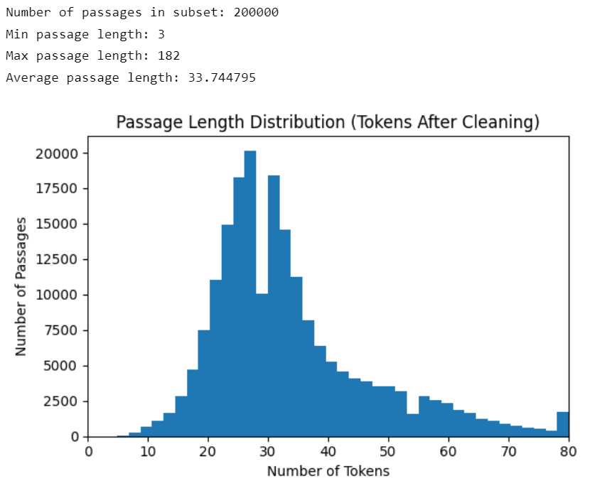
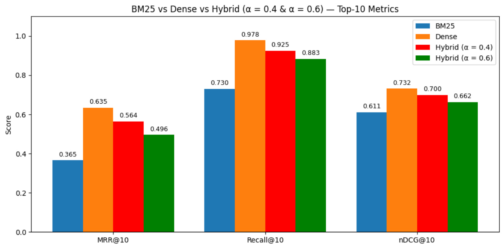
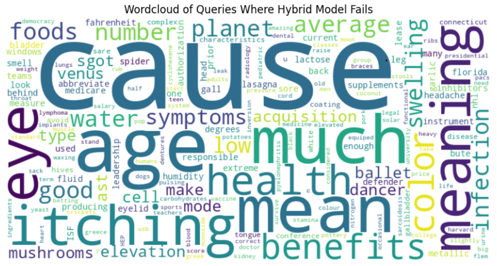

# 🔎 Hybrid Information Retrieval

### BM25 · Dense Retrieval · Hybrid Search · MS MARCO · NLP Evaluation

---

### 🔍 Overview

This project builds a **hybrid information retrieval system** that combines **BM25 lexical search** with **transformer-based dense retrieval**.

The goal is to compare how different retrieval methods perform on passage ranking tasks and analyze whether combining lexical and semantic signals improves search behavior.

The repository currently contains a Jupyter Notebook implementation for the MS MARCO passage ranking workflow.

---

### 🎯 Project Goal

Traditional keyword search is strong at exact matching, while dense retrieval captures semantic similarity.  
This project compares:

| Method | What It Captures |
|---|---|
| BM25 | Keyword / lexical relevance |
| Dense Retrieval | Semantic similarity |
| Hybrid Search | Combined lexical + semantic scoring |

---

### ✨ What This Project Does

- Loads and preprocesses MS MARCO passage data
- Analyzes passage length distribution after cleaning
- Builds a BM25-based lexical retrieval baseline
- Uses dense retrieval with transformer-style embeddings
- Combines retrieval scores using hybrid weighting
- Compares BM25, dense, and hybrid retrieval results
- Evaluates retrieval quality using ranking metrics
- Analyzes failure patterns using query word clouds

---

### 🧪 Evaluation Metrics

| Metric | Purpose |
|---|---|
| MRR@10 | Measures how highly the first relevant result appears |
| Recall@10 | Measures whether relevant results appear in the top 10 |
| nDCG@10 | Measures ranking quality with relevance weighting |

---

### 📊 Results & Visuals

#### Passage Length Distribution

Most cleaned passages are short, with an average passage length of about **33.7 tokens**.  
The longest passage is **182 tokens**, but most passages are under 80 tokens.

  

---

#### BM25 vs Dense vs Hybrid Retrieval

Dense retrieval performs strongest across the shown Top-10 metrics, while hybrid retrieval still improves over BM25 in this run.

  

---

#### Hybrid Failure Analysis

The word cloud highlights query terms where the hybrid model struggled, helping identify possible weaknesses in ranking behavior.

  

---

### 🛠️ Tech Stack

| Category | Tools / Methods |
|---|---|
| Language | Python |
| Environment | Jupyter Notebook |
| Dataset | MS MARCO Passage Ranking |
| Retrieval | BM25, Dense Retrieval, Hybrid Fusion |
| NLP / ML | Transformer-based embeddings |
| Evaluation | MRR@10, Recall@10, nDCG@10 |
| Analysis | Data preprocessing, ranking comparison, failure analysis |

---

### 👩‍💻 My Role

I worked on this project as an **Automation & Validation Engineer / Search Evaluation contributor**, focusing on:

- building the retrieval workflow
- preprocessing passage and query data
- comparing BM25, dense, and hybrid retrieval methods
- validating ranking behavior across retrieval strategies
- evaluating results using Top-10 ranking metrics
- analyzing failure patterns from query outputs

---

### ✅ Key Takeaways

- BM25 is useful for exact keyword matching.
- Dense retrieval captures semantic meaning better in this experiment.
- Hybrid retrieval can combine lexical and semantic signals, but weighting matters.
- Evaluation metrics are necessary to compare retrieval quality objectively.
- Failure analysis helps identify where the retrieval model needs improvement.

---

### ▶️ How to Run

1. Clone the repository.

   `git clone https://github.com/SHREENITHI-TV/Hybrid-Information-Retrieval.git`

2. Open the notebook.

   `hybrid_search_engine_msmarco.ipynb`

3. Install required dependencies if needed.

   `pip install numpy pandas scikit-learn matplotlib transformers torch rank-bm25 wordcloud`

4. Run the notebook cells in order.

5. Review the retrieval metrics, visualizations, and failure analysis.

---

### 📌 Project Relevance

This project demonstrates practical experience with:

- information retrieval
- search ranking evaluation
- NLP-based semantic retrieval
- BM25 lexical retrieval
- transformer-based embeddings
- metric-driven validation
- failure analysis
- AI-assisted evaluation workflows

---

### 🚀 Future Improvements

- Tune hybrid weighting more systematically
- Add Precision@K and Recall@K comparisons
- Evaluate on a larger query subset
- Add a lightweight search interface
- Package retrieval logic into reusable Python modules
- Add automated evaluation scripts

---

#### Built to compare lexical, semantic, and hybrid search behavior through metric-driven evaluation.

